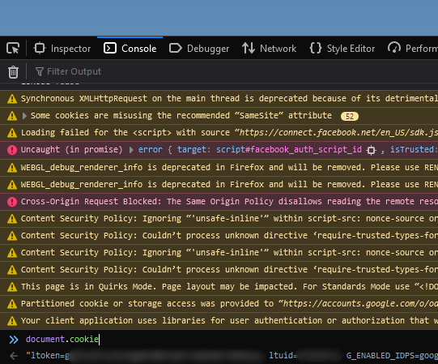
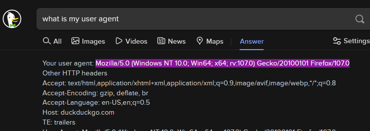
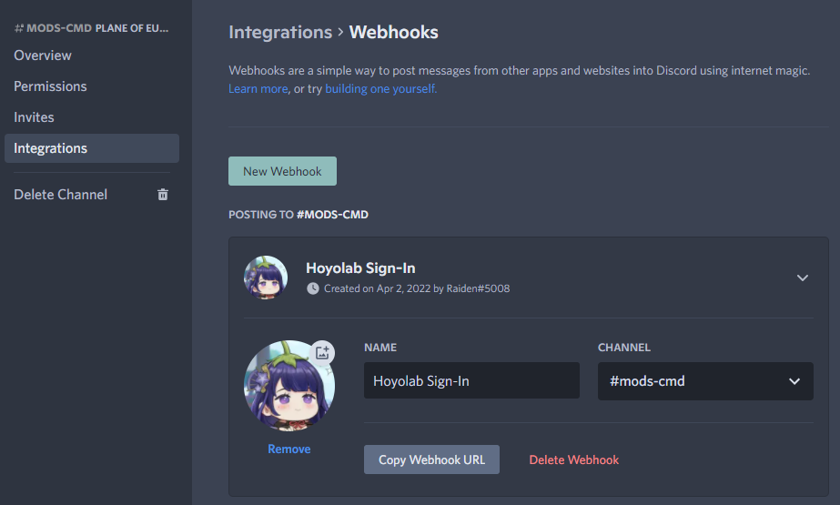
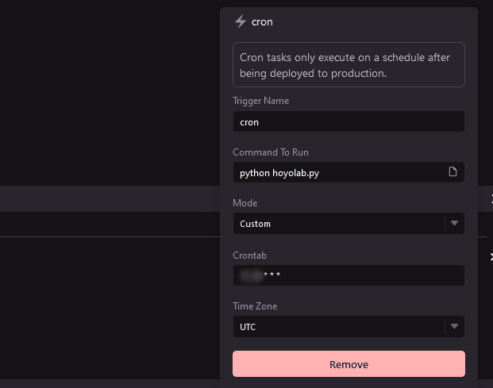
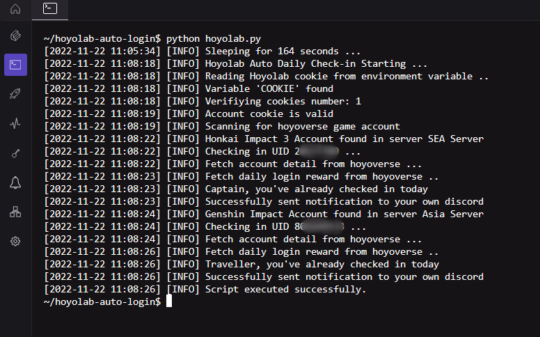

<h1 align="center">
  
  <b>Hoyolab Auto Daily Check-in</b>
</h1>

# Overview
A simple program that allows you to always claim Hoyolab's daily login system for Honkai Impact 3 and Genshin Impact. Original script by [vermaysha/Hoyolab-Auto-Daily-Checkin](https://github.com/vermaysha/Hoyolab-Auto-Daily-Checkin).

**Features:**
1. Send notification to Discord channel
2. Multiple accounts detection
3. Lightweight

# Installation
### 1. Make a WayScriptX Account at https://app.wayscript.com

### 2. Create a new Lair and clone the script by pasting the URL of this repo under `GitHub URL` field. The Lair's name is up to you.  


### 3. Navigate to left panel, click on `Secrets` and add the secrets with names listed below:
- `COOKIE`  
Navigate to [Hoyolab's Daily Checkin page](https://act.hoyolab.com/ys/event/signin-sea-v3/index.html?act_id=e202102251931481&lang=en-us) with your account __logged in__, open developer tools on your browser (F12 for Firefox/Chrome), navigate to `Console` tab, enter `document.cookie` in, copy the long-string text output **without** the quotation marks and save it as a secret named `COOKIE` in your Wayscript Lair. It will be saved with encryption and you won't be able to see it again.
  
**Disclaimer:** Your account cookie is sensitive and should not be shared with anyone.

- `USER_AGENT`  
You can get your user agent by just simply typing it in your search engine (Google/DuckDuckGo)  


- `DISCORD_WEBHOOK` **(Optional)**
You can have the script notify on a Discord channel via webhook. On any channel where you have webhook permissions in, go into:  
`Channel Settings > Integrations > Webhooks > New Webhook`  
You can also choose to use existing one by clicking on `Copy Webhook URL`  


### 4. Set up your trigger.
On left panel, click on `Overview` page and then `Open Triggers` on top right. There will be a Plus icon `+` on top right of the trigger panel for you to create a new CRON trigger. Use CRON expression to schedule it to run at your desired time by using this site: https://crontab.guru/  

The time is in UTC, for timezone converter you can refer here: https://www.worldtimebuddy.com/  

Now, enter your CRON expression in the `Crontab` field and `python hoyolab.py` under `Command To Run`. The trigger name can be whatever you want. The entry should appear in the Triggers list.  


### 5. Verify that your script is working.
In `Overview` tab from the left panel, click on `Open Terminal` and simply type `python hoyolab.py` and observe the output. You will need to wait for the random sleep timer before your script actually runs.
 

### 6. Deploy!
Once you've verified that your script runs without error, you can go ahead and deploy it. It will execute at the time you set in Step 4.  


# FAQ 
- If I play both Genshin and Honkai, does it log in both?  
Yes.

- How do I log in with multiple accounts?  
Add a `#` between your cookies.  
Example:  
```COOKIE1#COOKIE2#COOKIE3```

- How much time are we alloted on Wayscript X?  
According to Wayscript we are given 100 hours of runtime a month, this is more than plenty for the login script.  
Assuming (5min of sleep + 1min runtime) x 31 days = ~180min a month or about 3hours out of 100hours.